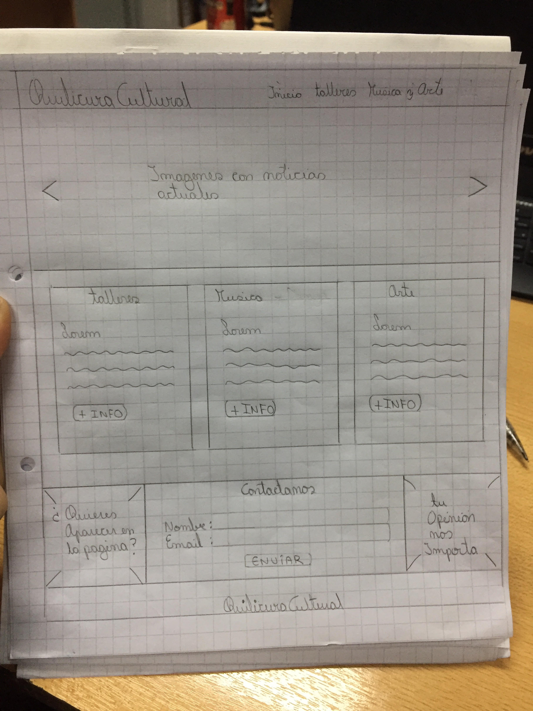
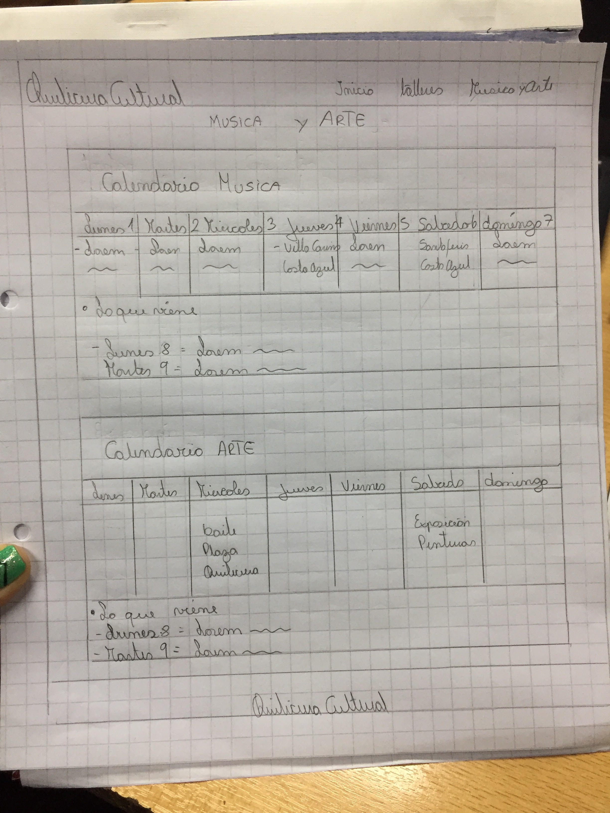
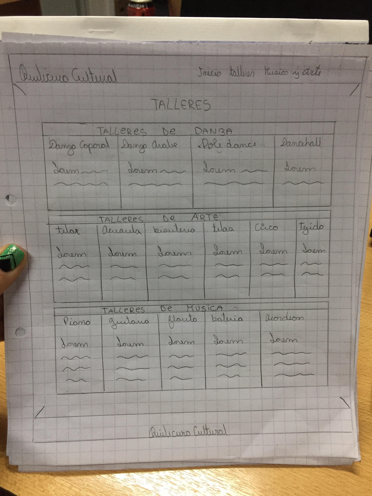

Proyecto Quilicura Cultural

Objetivos interfaz UI

la interaccion sera facil para el usuario todo muy visible de facil acceso y responsiva asi podra ser vista desde cualquier tipo de formato
diseño de los elementos como botones barras de navegacion seran personalizados con colores acorde al diseño de la pagina
diseño visual  seran de gran importancia para que el usuario le llame la atencion la informacion que se estara dando
las guias de estilo como fuentes seran muy claras para asi facilitar la lectura del usuario

Experiencia del usuario UX

el usuario al entrar a la pagina se sentira comodo ya que podra ubicar rapidamente lo que desea 
tendra poca opciones en la barra de navegacion los colores ayudaran a sentir tranquilidad armonia y creatividad.

-REQUERIMIENTOS DEL SITIO-

Quilicura Cultural sera una pagina enfocada en aportar con todos los datos de:
Talleres que se impartan en esta comuna y por quilicuranos  o impartidos por la municipalidad. 
Musica y Arte tendra un calendario donde se agregarán las fechas de eventos que se realicen en la comuna como grupos musicales locales o conocidos que se presenten en alguna tocata, pub, plaza,etc y con respecto a Arte incluira exposiciones bailes cuturales intervenciones,etc

Originalmente  sera solo para quilicura pero a futuro se podria  incluir datos importantes de toda la region Metropolitana.

-REQUISITOS GENERALES-

 pagina principal 
  - una barra de navegacion y un footer
  - 3 secciones:
     header o cabecera 
     seccion tipo blog 
     seccion donde se mostrara como conectarte con la pagina.

 pagina Talleres
  - barra de navegacion y un footer
  - 3 secciones
    cada una sera con un container y dentro de este se dividira dependiendo lo requerido

 pagina musica y Arte
  -barra de navegacion y un footer
  -2 secciones
  cada una sera un container y dentro de esta se dividira dependiendo lo requerido

-REQUERIMIENTOS VISUALES-

  -layout
   para crear layout usar bootstrap

  -fuentes (google font)
   titulos:Poppins
   parrafos y otros:Markazi Text

  -colores
   letras: #1bc4d3(calipso) #a80d86(morado) #16ba31(verde) #ffffff (blanco)
   botones y background de iconos: #1bc4d3(calipso) #a80d86(morado) #16ba31(verde)
   barra de navegacion:#212529
   letras de barra de navegaciony footer: #ffffff

- imagenes
  se encuentran dentro de la carpeta assents/img

-definicion de Layout-

 mi pagina  llevara de 2 a 3 columnas y dentro de estas iran más columnas dependiendo de cada pagina ya sea inicio, talleres o musica y arte
 pagina principal tendra un navegador cabecera una sección tipo blog con cards un jumbotron y un footer
 pagina de talleres llevara navegador una seccion dividida en 3 filas y luego un footer
 pagina de musica y arte llevara navegador un seccion dividida en 2 filas y un footer

-Boceto-

